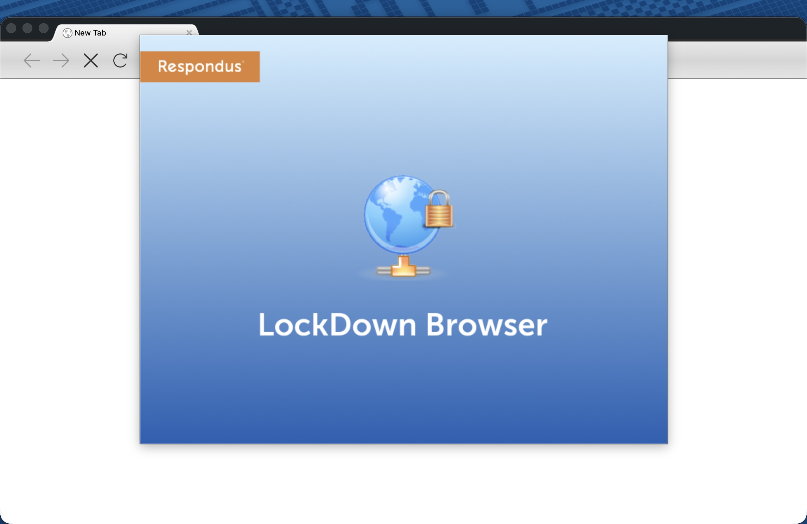
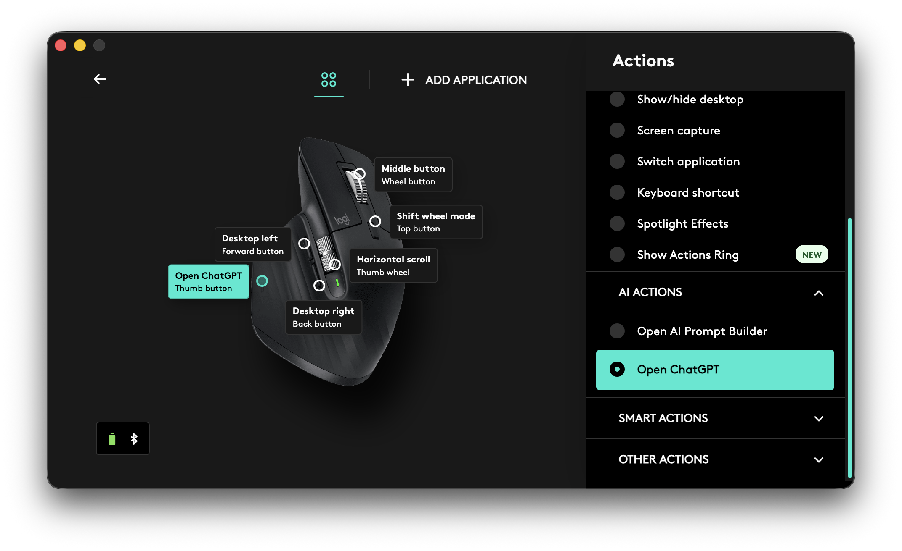
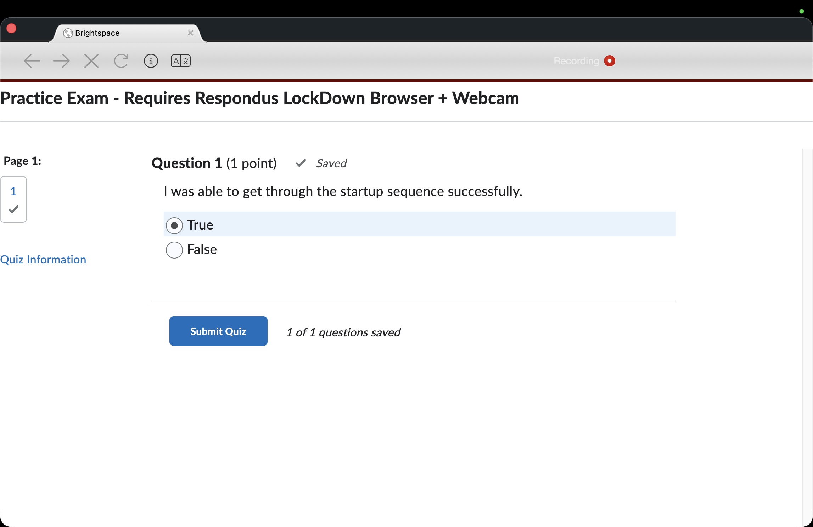
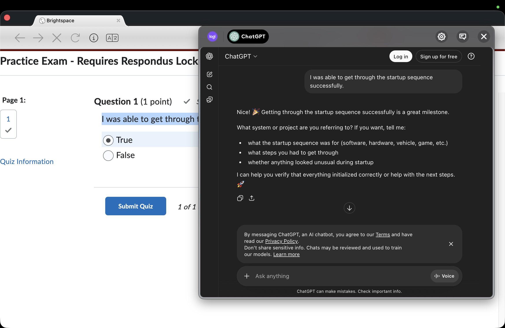

How a Logitech MX Master Mouse Can Bypass LockDown Browser
_A small experiment showing how hardware software integrations can unintentionally bypass exam browser restrictions._

Recently I came across something interesting while experimenting with tools on my system. With the new semester starting and lockdown exams becoming common again, I was exploring how some security tools behave in different environments.

This article is written **purely for awareness and educational purposes**.

## How LockDown Browser Works

LockDown Browser attempts to secure exams by restricting access to the operating system. It typically forces the browser window to stay on top of all other applications, preventing users from switching tasks, opening other programs, or accessing external resources.

However, when using **macOS**, things behave slightly differently. The browser continuously tries to stay on top of the system interface. You may notice it competing with macOS elements such as the **Notification Center**. When the Notification Center opens, it often closes immediately because the browser regains focus.

If you pay close attention, you might still be able to briefly see notification content — such as messages or updates before it disappears.

## New Screen Recording Feature

Before 2023, the browser did not record the entire screen during exams. Recently, however, **Respondus introduced screen recording** as part of their monitoring features. This allows instructors to review student activity and adds another layer of exam integrity.

The feature was introduced because the browser itself cannot fully lock down every aspect of the operating system.

## The Logitech MX Master Experiment

While testing different tools on my system, I was using my favorite mouse: **Logitech MX Master 3**, along with a Logitech keyboard.

Logitech provides software called **Logi Options+**, which allows users to program mouse buttons to perform specific actions. For example, you can assign shortcuts, launch applications, or trigger automation tasks.

One feature that caught my attention is the **“Open ChatGPT” action**. This allows you to quickly open ChatGPT directly from a mouse button instead of launching a browser tab or standalone app.

Interestingly, this action appears to open a **floating webview-style window** that sits above other applications.

That behavior raised an interesting question:

_What happens if this feature is triggered during a LockDown Browser exam?_

## Testing the Scenario

To test this, I launched a **practice test** inside LockDown Browser.

Then, using the programmed mouse button, I triggered the **Open ChatGPT** action from Logi Options+.
Which now you can copy questions and paste answers.

The result was surprising:  
The floating ChatGPT interface appeared **on top of the LockDown Browser window**.

At that point, it becomes possible to:
- Copy questions from the exam
- Paste them into the ChatGPT interface
- View generated answers

This effectively creates a workaround for the browser's interface restrictions.

## Important Notes

This article is meant **only for educational and security awareness purposes**. Identifying weaknesses in systems can help developers improve their protections.

It’s also important to remember that **instructors may still review recorded screen activity**, especially since Respondus introduced screen recording capabilities.
You can read more about that feature here:  
[https://support.respondus.com/hc/en-us/articles/43074545974427--Screen-Only-Recording-for-Respondus-Monitor](https://support.respondus.com/hc/en-us/articles/43074545974427--Screen-Only-Recording-for-Respondus-Monitor)

## Final Thoughts

Security systems often focus on restricting software behavior, but integrations between **hardware, drivers, and third-party tools** can sometimes introduce unexpected gaps.

This example highlights how modern productivity tools — especially those with floating interfaces and AI integrations — can interact with security software in ways that were not originally anticipated.

Improving exam security will likely require **closer coordination between operating system behavior, hardware integrations, and application-level restrictions.**

Fowzy Alsaud